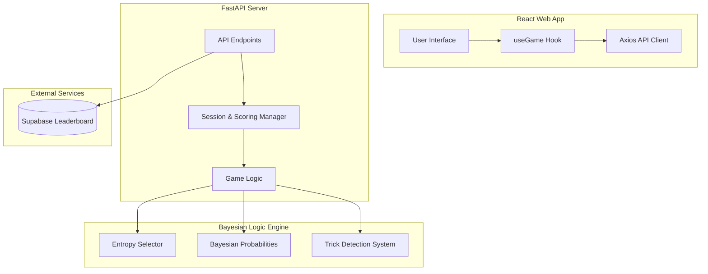
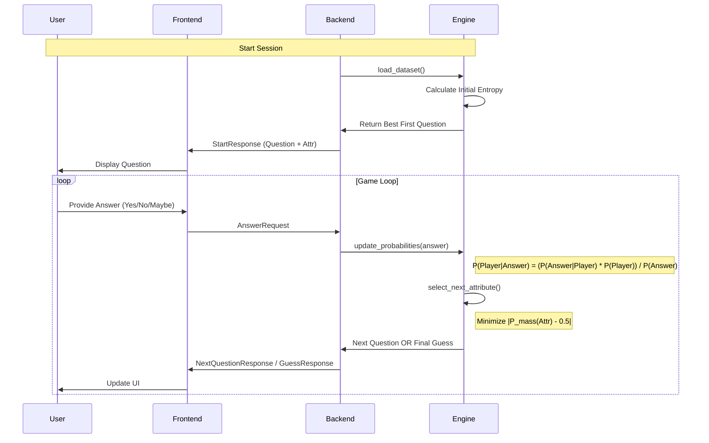
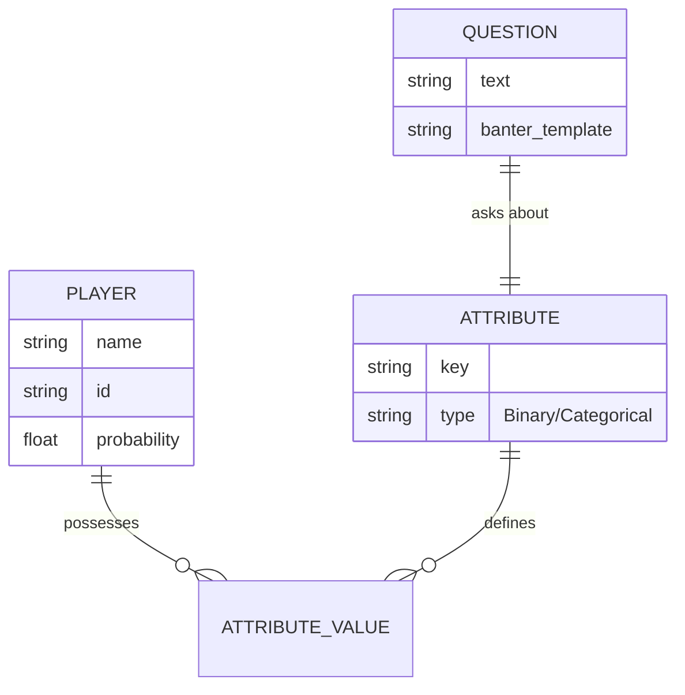

# 🗺️ IPL Akinator AI: System Graph & Knowledge Map

This document provides a structured, graphical representation of the entire repository. It is designed to be **AI-consumable** while remaining visually intuitive for humans.

---

## 🏗️ 1. High-Level Architecture

The system follows a classic **Client-Server** architecture with a specialized **Probabilistic Engine** and a **Global Leaderboard**.




---

## 🎮 2. Game Mechanics & Scoring

The project has been extended with a competitive game layer.

### 🧮 Scoring Logic
*   **Base Score**: `question_count * 10`
*   **Penalty/Bonus**: `wrong_guess_attempts * 50` (AI failure rewards the user)
*   **Trick Bonus**: Rewards users who successfully lead the AI into unlikely search paths while remaining consistent to a player.

### 😈 Trick Detection
The system monitors the **Probability Mass** of user answers. If a user provides an answer that is highly improbable given the current top candidates (P < 0.1), the `inconsistency_score` increases, contributing to the `trick_bonus` if the user wins.

---

## 📂 3. Repository Structure (Visual Tree)

The game operates on a cycle of **Question Selection** and **Probability Updates**.



---

## 📂 3. Repository Structure (Visual Tree)

```text
IPL_Akinator/
├── backend/                # 🐍 Python FastAPI Backend
│   ├── api/                # API Layer
│   │   ├── routes.py       # REST Endpoints
│   │   └── models.py       # Pydantic Schemas
│   ├── engine/             # 🧠 Mathematical Engine
│   │   ├── probability.py  # Bayesian Inference Logic
│   │   ├── selector.py     # Entropy-based Question Selection
│   │   └── constraints.py  # Hard filtering logic
│   ├── data/               # 📊 Dataset & Schemas
│   │   ├── players.json    # 250+ IPL Player Profiles
│   │   └── schema.json     # Question/Attribute mapping
│   └── main.py             # Server Entry Point
├── frontend/               # ⚛️ React/Vite Frontend
│   ├── src/
│   │   ├── components/     # UI Components (Cards, Chat, Progress)
│   │   ├── api/            # Backend communication logic
│   │   └── App.jsx         # Main Application Logic
│   └── package.json        # Dependencies
├── AI_CONTEXT.md           # Deep context for LLM agents
└── setup plan.md           # Deployment/Setup Guide
```

---

## 📊 4. Data Relationship Map

How the attributes and players are linked within the system.



---

## 🛠️ 5. Technology Stack Summary

| Layer | Technology | Primary Purpose |
| :--- | :--- | :--- |
| **Frontend** | React + Vite | Interactive, fast UI with state management. |
| **Backend** | Python + FastAPI | High-performance asynchronous API. |
| **Intelligence** | Bayesian Math | Probabilistic reasoning (handles uncertainty). |
| **Information** | Shannon Entropy | Optimizing question count (Binary search style). |
| **Styling** | Vanilla CSS/Tailwind | Premium look and feel. |

---

## 💡 AI Consumption Guide

If you are an AI assistant analyzing this repo:
1. **To modify questions**: Check `backend/data/schema.json`.
2. **To improve guessing logic**: Look at the likelihood matrix in `backend/engine/probability.py`.
3. **To change the UI flow**: Edit the state machine in `frontend/src/App.jsx`.
4. **To add players**: Run `backend/data/build_real_ipl_players.py`.

---
*Created by Antigravity AI*
